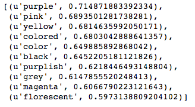

# Build and visualize Word2Vec model with Gensim

[**This code belongs to the "Build and Visualize Word2Vec Model on Amazon Reviews" blog post.**]()

**[Word2vec](https://en.wikipedia.org/wiki/Word2vec)** is a very popular ***[Natural Language Processing](https://en.wikipedia.org/wiki/Natural_language_processing)*** technique nowadays that uses a neural network to learn the vector representations of words called **"word embeddings"** in a particular text.

In this tutorial, we will use the excellent implementation of word2vec from the **[gensim](https://radimrehurek.com/gensim/index.html)** package to build our word2vec model. We will use [**t-Distributed Stochastic Neighbor Embedding (t-SNE) in sklearn**](http://scikit-learn.org/stable/modules/generated/sklearn.manifold.TSNE.html) to visualize the learned embeddings vectors.

## Requirements

* Python 2.7
* Jupyter Notebook
* gensim
* numpy
* pandas
* natural language toolkit (nltk)

## Dataset
We will use [the Amazon review corpus on Health and Personal Care](http://jmcauley.ucsd.edu/data/amazon/). The dataset is in **json** format and contains **346,355 reviews**.

## Model visualization

we visualize the learned embeddings using [**t-SNE**](http://scikit-learn.org/stable/modules/generated/sklearn.manifold.TSNE.html). **t-SNE** is a tool for data visualization that reduces the dimensionality of data to 2 or 3 dimensions so that it can be plotted easily.

## Most similar words
One way to check if we have a good word2vec model is to use the model to find the most similar words to a specific word. For that, we can use the `most_similar` function that returns the 10 most similar words to the given word. Let's find the most similar words to the word **`blue`**.

## References
[How to Make Word Vectors from Game of Thrones (LIVE)](https://www.youtube.com/watch?v=pY9EwZ02sXU)

